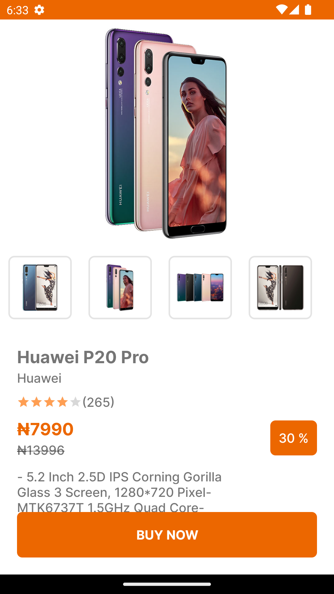
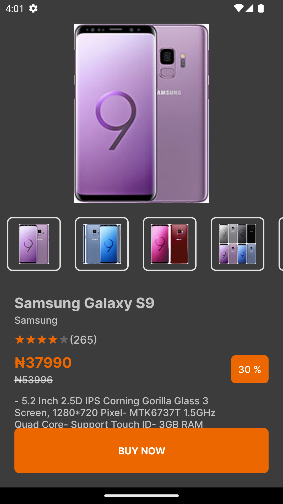

# Ptc challenge
Ptc Challenge demonstrates modern Android development with Hilt, Coroutines, Flow, Jetpack (Room, ViewModel), and Material Design based on MVVM architecture.
_
### Screenshots

### Tech stack & Open-source libraries
- Minimum SDK level 21
- [Kotlin](https://kotlinlang.org/)
  based, [Coroutines](https://github.com/Kotlin/kotlinx.coroutines)
    + [Flow](https://kotlin.github.io/kotlinx.coroutines/kotlinx-coroutines-core/kotlinx.coroutines.flow/)
      for asynchronous.
- Jetpack
    - Lifecycle: Observe Android lifecycles and handle UI states upon the lifecycle changes.
    - ViewModel: Manages UI-related data holder and lifecycle aware. Allows data to survive
      configuration changes such as screen rotations.
    - DataBinding: Binds UI components in your layouts to data sources in your app using a declarative
      format rather than programmatically.
    - Room: Constructs Database by providing an abstraction layer over SQLite to allow fluent database
      access.
    - [Hilt](https://dagger.dev/hilt/): for dependency injection.
- Architecture
    - MVVM Architecture (View - DataBinding - ViewModel - Model)
    - Clean architecture
    - Repository Pattern
- [Retrofit2 & OkHttp3](https://github.com/square/retrofit): Construct the REST APIs and paging
  network data.
- [MotionLayout](https://developer.android.com/develop/ui/views/animations/motionlayout):  Layout type that helps you manage motion and widget animation in your app.
- [GSON](https://github.com/google/gson): A modern JSON library for Kotlin and Java.
- [Glide](https://github.com/bumptech/glide): Image loading framework for Android that wraps media decoding